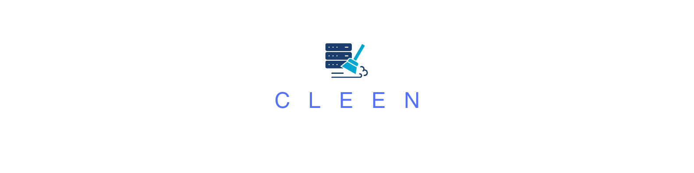

Cleen is an open-source, production-grade Python framework for building scalable, modular data cleaning pipelines. It provides a unified environment with connectors, processors, validators, and monitoring tools to transform messy, raw data into high-quality, actionable datasets.

---

## Table of Contents

- [Goals](#goals)
- [Features](#features)
- [Project Structure](#project-structure)
- [Roadmap](#roadmap)
- [Getting Started](#getting-started)
- [Contributing](#contributing)
- [License](#license)

---

## Goals

- **Robust Data Cleaning:** Provide a comprehensive suite of tools to cleanse, validate, and enrich data from various sources.
- **Scalability:** Enable parallel processing and efficient handling of large datasets with a flexible execution engine.
- **Modularity & Extensibility:** Allow seamless integration of new connectors, processors, validators, and plugins to meet evolving business needs.
- **Production Readiness:** Incorporate built-in monitoring, logging, and error-handling mechanisms to ensure reliability in production environments.
- **Open Collaboration:** Foster an active community to extend and improve the framework.

---

## Features

- **Connectors:** Load and save data from CSV, JSON, Parquet, Excel, databases, APIs, and streaming sources.
- **Processors:** Structured and unstructured data cleaning, type conversion, pattern validation, and enrichment.
- **Validators:** Schema and rule-based validation to enforce data quality.
- **Pipeline Builder:** Create flexible, chainable pipelines using a fluent API.
- **Parallel Execution:** Scale data cleaning tasks using a configurable parallel executor.
- **Monitoring & Metrics:** Integrated resource monitoring, logging, and data quality reporting.
- **Plugin System:** Extend the framework with community-contributed modules.

---

## Project Structure

```plaintext
Cleen/
├── 
│   cleen/
│       ├── core/
│       ├── connectors/
│       ├── processors/
│       ├── validators/
│       ├── llm_agents/
│       ├── pipeline/
│       ├── monitoring/
│       ├── plugins/
│       └── utils/
├── config/
├── tests/
├── examples/
├── docs/
├── scripts/
├── setup.py
├── pyproject.toml
├── requirements/
├── README.md
├── CHANGELOG.md
└── LICENSE
```

Each directory is organized by responsibility, ensuring separation of concerns and ease of maintenance.

---

## Roadmap

### Short Term
- **Core Enhancements:** Refine existing connectors and processors.
- **Improved Testing:** Increase test coverage and add integration tests.
- **Documentation:** Expand the getting started guide and API reference.

### Medium Term
- **Plugin Ecosystem:** Develop a plugin registry and encourage community contributions.
- **Performance Optimization:** Enhance the parallel execution and caching mechanisms.
- **CI/CD Integration:** Set up automated testing and deployment pipelines.

### Long Term
- **Advanced Validation:** Integrate with third-party schema validation libraries.
- **Enterprise Features:** Add support for secure configuration management and cloud-based deployments.
- **Community Engagement:** Host webinars, code-alongs, and collaborative projects to foster an active user base.

---

## Getting Started

1. **Clone the Repository:**

   ```bash
   git clone https://github.com/ahammadnafiz/Cleen.git
   cd cleen
   ```

2. **Install Dependencies:**

   ```bash
   pip install -r requirements/base.txt
   ```

3. **Run the Demo:**

   Navigate to the `examples/basic_usage` folder and run one of the demo scripts to see Cleen in action.

   ```bash
   python demo_pipeline.py
   ```

4. **Explore the Documentation:**

   Detailed guides and API references are available in the `docs/` directory.

---

## Contributing

We welcome contributions! Please check out our [contributing guidelines](docs/contributing.md) and [code of conduct](docs/CODE_OF_CONDUCT.md) before submitting a pull request.

- **Issues:** Report bugs and feature requests on our [GitHub Issues](https://github.com/ahammadnafiz/Cleen/issues) page.
- **Pull Requests:** Follow our [PR guidelines](docs/CONTRIBUTING.md) to help us keep the codebase clean and maintainable.

---

## License

Cleen is licensed under the [MIT License](https://github.com/ahammadnafiz/Cleen/blob/main/LICENSE).

---

*Transform messy data into actionable insights with Cleen — join our community and help us build the future of data cleaning pipelines!*
